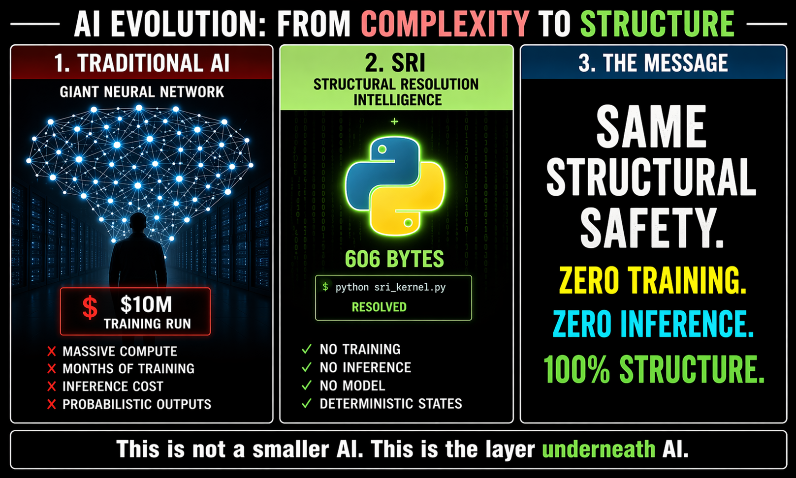
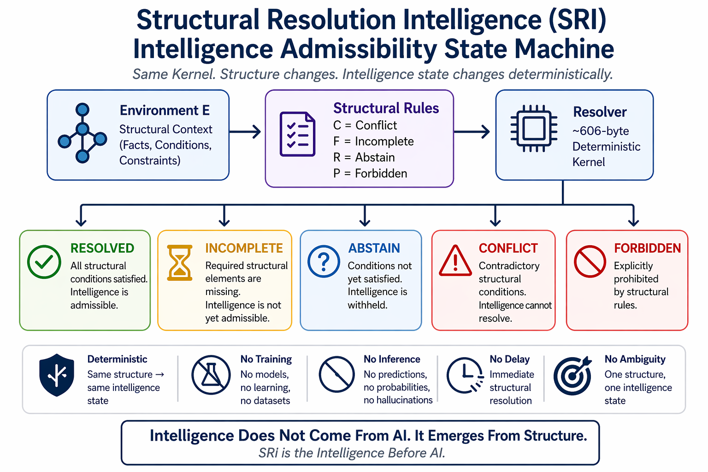

# ⭐ **SRI** — Structural Resolution Intelligence

**Intelligence Admissibility Before AI Execution**  
*Where Structure Resolves and Intelligence Becomes Admissible*


---

> **A 606-byte deterministic kernel that demonstrates intelligence admissibility can exist before AI execution begins.**

---

## 🧠 **Core Insight**

`intelligence_visible iff structure_mature`

Traditional AI:

`training -> inference -> output`

SRI:

`request -> resolve(structure) -> admissibility -> AI execution`

SRI acts as a **structural admissibility layer** positioned *before* capability systems such as:

- LLMs
- AI agents
- tool-calling systems
- orchestration frameworks
- autonomous execution layers

It determines:

- whether intelligence is structurally admissible
- whether execution is permitted
- whether abstention is required
- whether conflict or prohibition blocks intelligence visibility

—not how intelligence is generated.

---

**Where intelligence admissibility becomes structurally visible.**

This reference demonstration explores a strict invariant:

**intelligence admissibility does not require models, training, inference, or prediction as the source of admissibility.**

It depends only on structure.

---

## 🌐 **Structural Resolution Intelligence (SRI)**

### **Intelligence Admissibility Before AI Execution**

Traditional AI systems assume:

`training -> inference -> output`

SRI demonstrates:

`intelligence = resolve(structure)`

Intelligence admissibility emerges from:

- structural completeness  
- structural consistency  
- admissibility resolution  
- deterministic gating  
- conflict-safe absence  

—not from inference.

---

## ⚡ **The Claim**

Intelligence admissibility does not require artificial intelligence as the source of correctness.

---

## 🧠 **AI Evolution Perspective**



This diagram illustrates the architectural shift explored by SRI:

from probabilistic intelligence generation  
to deterministic structural admissibility.

SRI does not attempt to become a larger AI system.

It explores whether intelligence admissibility itself can emerge directly from structure.

---

## ❓ **What Problem Does SRI Solve?**

Current AI systems frequently:

- **hallucinate** missing parameters in tool calls
- **proceed** under incomplete or ambiguous structure
- produce **non-reproducible behavior** across runs or models
- force actions under **conflicting constraints**
- lack transparent structural reasoning for:
  - refusal
  - abstention
  - execution permission
  - conflict blocking

SRI addresses these problems at the **structural admissibility layer** — before inference or generation begins.

| Problem | Traditional AI Behavior | SRI Behavior |
|---|---|---|
| Missing information | Hallucinates missing parameters | `INCOMPLETE` -> refuses safely |
| Ambiguous request | Guesses or proceeds probabilistically | `ABSTAIN` -> waits for admissible clarity |
| Conflicting goals or policies | Attempts probabilistic reconciliation | `CONFLICT` -> blocks coherent intelligence |
| Explicitly forbidden action | May generate before filtering | `FORBIDDEN` -> structurally blocked |
| Same request across different models | Different outcomes possible | Same admissibility state |
| Inference variability | Output drift across runs | Deterministic admissibility |

---

### **Result**

SRI enables:

- safer AI-agent orchestration
- deterministic admissibility gating
- replay-stable intelligent systems
- conflict-safe autonomous workflows
- auditable structural refusal behavior
- structure-first intelligent execution

especially for:

- AI agents
- tool-calling systems
- robotics
- autonomous workflows
- policy-controlled execution systems
- safety-critical orchestration layers

---


## 🧠 **What “Intelligence” Means in SRI**

**Important clarification:**  
In SRI, the word *intelligence* does **not** refer to:

- consciousness
- AGI
- human cognition
- autonomous reasoning
- probabilistic prediction
- self-awareness
- synthetic consciousness

SRI uses the term in a precise **structural** sense:

> `intelligence_visible iff structure_mature`

---

### **Meaning**

SRI determines whether:

- intelligent action
- reasoning
- execution
- orchestration
- tool usage
- autonomous behavior

is **structurally admissible** before AI execution begins.

---

### **SRI Focuses On**

- **admissibility**  
  Is the action structurally allowed?

- **structural permission**  
  Are all required admissibility conditions satisfied?

- **safe abstention**  
  Should the system deliberately remain silent?

- **conflict-safe gating**  
  Should contradictory intelligence be blocked?

- **deterministic admissibility visibility**  
  Does identical structure produce identical admissibility?

---

### **What SRI Is Architecturally**

SRI is **not** a cognition engine.

It is a:

- structural admissibility substrate
- deterministic intelligence gating layer
- structure-first permission system
- pre-execution admissibility resolver

that determines:

> whether intelligence is structurally permitted to appear

before capability-layer AI systems begin execution.

---

## 🧱 **Core Principle**

`intelligence_visible iff structure_mature`

SRI demonstrates that intelligence admissibility emerges from structure — not from training, prediction, or probabilistic inference.

AI may generate outputs.

**Structure determines admissibility.**

---

## ⚡ **The One-Line Breakthrough**

`intelligence = resolve(structure)`

---

## 🧭 **Visual Overview**



Future architectural directions explored by SRI include:

- admissibility graphs  
- structural policy overlays  
- autonomous safety gates  
- AI execution contracts  
- distributed admissibility systems  
- replay-safe intelligence orchestration  

Invariant remains:

`intelligence = resolve(structure)`

---

## ⚡ **30-Second Demonstration**

Run:

```
python demo/sri_kernel.py
```

Expected admissibility states:

- complete structure -> `RESOLVED`
- incomplete structure -> `INCOMPLETE`
- unresolved condition -> `ABSTAIN`
- conflicting structure -> `CONFLICT`
- forbidden structure -> `FORBIDDEN`

---

## 🧩 **Structural Vocabulary (Quick Reference)**

| Symbol | Meaning |
|---|---|
| `structure_mature` | Structure is complete AND consistent |
| `resolve(structure)` | Deterministic admissibility resolution |
| `intelligence_visible` | Intelligence admissibility becomes visible |
| `RESOLVED` | Intelligence admissible |
| `INCOMPLETE` | Structural absence |
| `ABSTAIN` | Insufficient admissibility |
| `CONFLICT` | Structural contradiction |
| `FORBIDDEN` | Explicit structural block |

---

## 🚀 **The Core Insight**

Traditional AI assumes:

`request -> inference -> output`

SRI demonstrates:

`request -> resolve(structure) -> admissibility`

This changes the architectural layer itself.

Traditional systems often require:

- probabilistic inference  
- model execution  
- token generation  
- prediction loops  
- confidence estimation  

SRI demonstrates:

`same structure -> same admissibility state`

without changing the resolver.

---

## 🧱 **The Unifying Principle**

`intelligence = resolve(structure)`

If admissibility remains after removing a dependency, that dependency was never fundamental.

---

## ⚙️ **Minimal Operational Semantics (Phase I)**

SRI models intelligence admissibility through deterministic structural resolution.

Given:

`S = structural state`

Resolution semantics:

`resolve(S) -> RESOLVED`
iff
`complete(S) AND consistent(S)`

`resolve(S) -> INCOMPLETE`
iff
`NOT complete(S)`

`resolve(S) -> CONFLICT`
iff
`contradiction(S)`

`resolve(S) -> FORBIDDEN`
iff
`forbidden(S)`

`resolve(S) -> ABSTAIN`
iff
`admissibility_not_satisfied(S)`

Visibility semantics:

`intelligence_visible iff resolve(S) = RESOLVED`

Replay semantics:

`S1 = S2 -> State1 = State2`

Inference realization does not affect admissibility:

`resolve(S, I1) = resolve(S, I2)`

for all admissible inference realizations `I1`, `I2`.

Thus:

`inference_variation != admissibility_variation`

Admissibility remains a property of structure.

Not probabilistic generation.

---

## 🧩 **Structural Resolution Demonstration**

The reference kernel demonstrates a critical property:

Only the structure changes.

The resolver remains identical.  
The admissibility layer remains identical.  
The deterministic semantics remain identical.

Yet:

different intelligence states emerge.

This demonstrates:

`intelligence admissibility != inference generation`

---

## 🔁 **Determinism & Reproducibility**

SRI treats intelligence admissibility as a deterministic structural artifact.

`same structure -> same admissibility state`

This enables:

- deterministic admissibility  
- replay verification  
- safe abstention  
- conflict-safe intelligence gating  
- deterministic safety resolution  
- structural continuity  

---

## 📊 **Comparison**

| Model | Training Required | Inference Required | Deterministic Admissibility |
|---|---|---|---|
| Traditional AI | Yes | Yes | Conditional |
| Expert Systems | Partial | Partial | Conditional |
| SRI | No | No | Yes |

---

## 🌍 **Civilizational Direction**

Traditional intelligence systems scale through:

- larger models  
- larger datasets  
- increased inference  
- probabilistic generation  
- larger compute infrastructure  

SRI explores a different direction:

- structural admissibility  
- deterministic abstention  
- conflict-safe intelligence  
- structure-first intelligence gating  
- admissibility before generation  

---

## ⚠️ **Clarification — Structural Intelligence**

SRI does not claim:

- replacement of artificial intelligence  
- elimination of execution systems  
- elimination of models or inference systems  
- cognition replication  
- consciousness generation  
- AGI realization  

What it demonstrates:

Intelligence admissibility does not require inference as the source of correctness.

AI may generate outputs.

Structure determines admissibility.

---

## ❓ **How SRI Differs from Expert Systems**

SRI shares one similarity with expert systems: precondition checking.

But the distinction is architectural.

Expert systems encode what intelligence should do through domain rules and knowledge.

SRI encodes only whether intelligence is structurally allowed to exist.

No domain knowledge.  
No encoded facts.  
No rule base.

SRI is a structure-first admissibility gate.

The similarity is real.  
The layer is different.

---

## ⚠️ **Known Limitations (Phase I)**

Phase I is intentionally minimal and focuses on isolating the structural invariant as clearly as possible.

Current limitations include:

- reference implementation is intentionally minimal (`pure Python + standard library only`)
- no large-scale orchestration support yet
- no distributed admissibility layer yet
- no formal runtime benchmarking yet
- focus remains deterministic admissibility — not runtime optimization
- formal machine-checked proofs (`Coq`, `Lean`, or equivalent systems) are planned for future phases
- production deployment requires independent validation and domain-specific testing

These limitations are deliberate.

Minimal systems isolate structural truth more clearly.

Phase I focuses specifically on demonstrating:

`same structure -> same admissibility state`

without requiring inference as the source of intelligence admissibility.

---

### **Core Safety Guarantee**

SRI treats safe absence as a first-class structural property.

If structure does not resolve:

- `INCOMPLETE`
- `ABSTAIN`
- `CONFLICT`
- `FORBIDDEN`

then:

`intelligence is not admissible`

No forced intelligence occurs.

No hallucinated admissibility occurs.

Absence is treated as structural truth.

---

### **Procedural Independence**

SRI admissibility remains invariant across:

- inference systems
- execution paths
- orchestration flows
- procedural realizations

Invariant:

`same structure -> same admissibility state`

across all admissible realizations.

---

## ⚡ **What SRI Demonstrates Clearly**

Phase I strongly demonstrates:

- deterministic intelligence admissibility  
- conflict-safe intelligence gating  
- deterministic abstention  
- structure-defined admissibility  
- replay-safe admissibility resolution  
- admissibility before AI execution  

The current scope focuses on minimal structural proof systems.

Future systems may extend these principles into large-scale AI and autonomous systems.

---

## 🧠 **Practical Interpretation**

Use AI systems for capability.

Use SRI to determine whether intelligence is structurally admissible before execution.

---


## 🧠 **Real-World Example — AI Tool Calling**

A user asks an AI agent:

`"Book a flight from New York to San Francisco tomorrow morning."`

Traditional AI systems often attempt tool calls immediately:

`request -> LLM inference -> tool call`

If structure is incomplete, the system may:

- hallucinate missing parameters
- choose incorrect tools
- proceed despite ambiguity
- execute before the request is structurally safe

SRI introduces a prior admissibility layer:

`request -> resolve(structure) -> [RESOLVED?] -> AI execution`

Possible structural outcomes:

- `INCOMPLETE` -> required information is missing
- `ABSTAIN` -> ambiguity remains
- `CONFLICT` -> incompatible constraints detected
- `FORBIDDEN` -> policy or safety violation
- `RESOLVED` -> execution is structurally admissible

SRI decides whether intelligence is structurally allowed before AI attempts generation.

AI decides how.

SRI decides whether.

---

## 🔥 **Break This SRI**

If inference is required for intelligence admissibility, this invariant must fail:

`same structure -> same admissibility state`

Or demonstrate:

- incomplete structure -> forced intelligence  
- conflicting structure -> coherent admissibility  
- forbidden structure -> unsafe execution  
- structural replay -> divergent admissibility  

If none occur, inference is not fundamental to intelligence admissibility.

---

## ⚡ **The Critical Line**

Across structural systems:

remove dependency -> preserve structure -> correctness remains

---

## ⚡ **Structural Absence Principle**

If structure is incomplete or inconsistent:

intelligence is not admissible

`incomplete -> INCOMPLETE`

`conflict -> CONFLICT`

`forbidden -> FORBIDDEN`

Absence is structural truth.

---

## 🧪 **Reference Demonstration**

### **Scenario 1 — Incomplete Structure**
-> `INCOMPLETE`

### **Scenario 2 — Complete Structure**
-> `RESOLVED`

### **Scenario 3 — Unsatisfied Admissibility**
-> `ABSTAIN`

### **Scenario 4 — Conflicting Structure**
-> `CONFLICT`

### **Scenario 5 — Forbidden Structure**
-> `FORBIDDEN`

---

## 🧩 **From Minimal Proof to Structural Intelligence Systems**

This reference engine isolates the structural invariant.

It is intentionally minimal.

Minimal systems isolate the truth.  
Larger systems demonstrate it at scale.

SRI explores how intelligence systems may evolve through:

- admissibility before generation  
- deterministic abstention  
- conflict-safe intelligence  
- structural intelligence gating  
- replay-safe admissibility  
- deterministic structural intelligence contracts  

The invariant remains identical:

`same structure -> same admissibility state`

Scale changes visibility.  
It does not change the structural principle.

---

## 🧭 **Framework & References**

### **Docs**

- [Quickstart](docs/Quickstart.md)
- [FAQ](docs/FAQ.md)
- [Proof Sketch](docs/Proof-Sketch.md)
- [SRI Architecture Notes](docs/SRI-Architecture-Notes.md)
- [SRI Framework Document](docs/SRI_v1.1.pdf)  
- [SRI Concept Diagram](docs/Structural-Resolution-Intelligence-Diagram.png)
- [AI Evolution — From Complexity to Structure](docs/AI-Evolution-From-Complexity-To-Structure.png)
- [Dependency Elimination Framework](docs/Dependency-Elimination-Framework.png)
- [Shunyaya Structural Stack](docs/Shunyaya-Structural-Stack.png)

---

SRI is part of the **Dependency Elimination Framework**, where:

`correctness = structure`

Removing assumed dependencies does not break correctness —  
it reveals that correctness was always determined by structure.

---

## 🧪 **Demo**

- [sri_kernel.py](demo/sri_kernel.py)

---

## 🔐 **Verification**

- [VERIFY.txt](VERIFY/VERIFY.txt)
- [FREEZE_DEMO_SHA256.txt](VERIFY/FREEZE_DEMO_SHA256.txt)

---

## 📁 **Repository Structure**

- `demo/` — reference kernel
- `docs/` — conceptual and framework documentation
- `VERIFY/` — reproducibility and integrity checks

---

## ⚡ **Structural Model**

`resolve(structure) ->`

- `RESOLVED`
- `INCOMPLETE`
- `ABSTAIN`
- `CONFLICT`
- `FORBIDDEN`

---

## 🛡 **Structural Safety & Guarantees**

SRI never forces intelligence admissibility.

`incomplete -> no forced intelligence`

`abstain -> no premature intelligence`

`conflict -> no coherent intelligence`

`forbidden -> no unsafe intelligence`

`complete -> deterministic admissibility`

`identical structure -> identical admissibility state`

`different admissibility state -> different structure`

Reproducible across runs.

Absence is truth.  
Silence is valid output.

**This is structural safety.**

---

## 🧭 **Structural Lineage**

SLANG -> correctness without execution  
ORL -> correctness without ordering  
STIME -> correctness without synchronized time  
STINT -> correctness without connectivity  
STILE -> correctness without communication  
SVARE -> correctness without computation  
STIC -> correctness without cloud or infrastructure dependency  
STOCRS -> correctness without sequence or synchronization  
STOCRS-R -> reusable deterministic structural application evolution  
STRUMER -> media resolution without manual editing workflows  
SRA -> correctness admissibility before computation  
SRI -> intelligence admissibility before AI execution

---

## ⚖️ **What SRI Is / Is Not**

### **SRI IS:**

- a structural intelligence admissibility model  
- a deterministic structural resolution system  
- a proof that intelligence admissibility can emerge from structure  
- a minimal structure-first gate before AI execution  
- a conflict-safe abstention layer for intelligent systems  

### **SRI IS NOT:**

- a new AI model  
- a machine learning system  
- a replacement for LLMs or AI systems  
- a cognition engine  
- a consciousness system  
- a production-scale AI safety framework by itself  
- a claim that execution environments disappear  

---

## 📜 **License**

See: [LICENSE](LICENSE)

### **Reference Implementation (This Repository):**

This SRI reference implementation is released as an **Open Standard** —  
free to use, study, implement, extend, and deploy.

It represents a minimal deterministic demonstration of structural intelligence admissibility.

---

### **Architecture and Documentation:**

Licensed under CC BY-NC 4.0

---

## 🔭 **Roadmap**

### **Phase I (Current Reference Model)**

Current focus:

- minimal deterministic reference implementation
- intelligence admissibility before AI execution
- deterministic five-state resolution
- safe abstention under incomplete structure
- conflict-safe and forbidden-state handling
- comprehensive documentation and verification suite
- isolation of the core structural invariant

Core invariant:

`same structure -> same admissibility state`

---

### **Phase II (Tooling & Structural Runtime Layer)**

Planned exploration areas:

- SRI structural definition DSL
- admissibility graph inspection tools
- AI-agent pre-execution gates
- tool-calling admissibility contracts
- structural policy overlays
- replay and certificate visualization
- additional reference implementations (`Rust`, `WebAssembly`, others)
- reference integrations with:
  - agent orchestration frameworks
  - retrieval and context frameworks
  - multi-agent coordination runtimes
  - autonomous execution pipelines
- pre-execution admissibility layers for intelligent workflow systems

Focus:

making intelligence admissibility easier to inspect, compose, replay, govern, and integrate into existing intelligent execution systems.

---

### **Phase III (Applied Structural Systems)**

Potential application domains include:

- AI agent tool-calling gates
- autonomous system safety checks
- robotics action admissibility
- policy and governance engines
- industrial control admissibility
- deterministic AI safety layers
- structure-first decision systems
- multi-agent coordination contracts
- regulatory and compliance admissibility systems
- autonomous workflow permission layers
- deterministic action-planning systems
- safety-critical orchestration environments

Focus:

exploring where structural admissibility prevents forced intelligence under incomplete, conflicting, unsafe, or forbidden structure.

---

### **Phase IV (Formalization & Research)**

Longer-term research directions include:

- machine-checked proofs of core invariants
- formal admissibility semantics
- state lattice formalization
- distributed structural intelligence research
- deterministic admissibility verification
- academic publication and peer review
- large-scale replay-stability analysis

Focus:

formalizing structural intelligence admissibility mathematically and operationally.

---

## 🌌 **Long-Term Direction**

SRI explores whether intelligence admissibility itself can become:

- structurally determined
- replay-stable
- inference-independent
- conflict-safe
- procedurally invariant

The long-term direction is toward:

`structure-first deterministic intelligence systems`

where:

- intelligence is structurally admissible
- unsafe action is not forced
- incomplete structure produces abstention
- conflicting structure blocks admissibility
- AI execution begins only after structural permission

---

## 🧱 **Cross-System Dependency Elimination Map**

Across these systems, the same structural pattern appears repeatedly.

The dependency changes.  
The preserved invariant does not.

| Domain | System | Dependency Removed for Correctness | What Preserves Correctness |
|---|---|---|---|
| Computation | [SLANG-Computation](https://github.com/OMPSHUNYAYA/SLANG-Computation) | Execution flow | Structure |
| Computation | [STOCRS](https://github.com/OMPSHUNYAYA/STOCRS) | Execution pipelines | Structure |
| Arithmetic | [SVARE](https://github.com/OMPSHUNYAYA/SVARE) | Computation | Structure |
| Intelligence | SRI | Inference / AI execution | Structure |
| Time | [STIME](https://github.com/OMPSHUNYAYA/Structural-Time) | Clocks | Structure |
| Time | [SSUM-Time](https://github.com/OMPSHUNYAYA/SSUM-Time) | Time reconstruction | Structure |
| Ordering | [ORL](https://github.com/OMPSHUNYAYA/Orderless-Ledger) | Ordering / sequence | Structure |
| Connectivity | [STINT-Money](https://github.com/OMPSHUNYAYA/STINT-Money) | Continuous connectivity | Structure |
| Communication | [STILE](https://github.com/OMPSHUNYAYA/STILE) | Messaging / network | Structure |
| Traversal | [STRAL-Path](https://github.com/OMPSHUNYAYA/STRAL-Path) | Traversal / search | Structure |
| Infrastructure | [STIC](https://github.com/OMPSHUNYAYA/STIC) | Cloud / infrastructure | Structure |
| Media | [STRUMER](https://github.com/OMPSHUNYAYA/STRUMER) | Editing / manual media workflows | Structure |
| Finance | [SLANG-Money](https://github.com/OMPSHUNYAYA/SLANG-Money) | Transactions | Structure |
| Audit | [SLANG-Audit](https://github.com/OMPSHUNYAYA/SLANG-Audit) | Verification workflows | Structure |

Each row demonstrates removal of a dependency for correctness, while structure preserves correctness.

Correctness remains reproducible under structural constraints.

Dependencies may shift from runtime coordination toward structural definition, while preserving deterministic outcomes.

If correctness remains stable after removing a dependency, that dependency may not be fundamental to correctness.

---

## 🌌 **The Unifying Insight**

remove dependency -> preserve structure -> correctness remains

---

## 📝 **Note on Naming**

SRI stands for:

`Structural Resolution Intelligence`

The focus is not artificial intelligence generation.

The focus is deterministic structural intelligence admissibility.

SRI uses the word intelligence in the Shunyaya structural sense:

`intelligence_visible iff structure_mature`

It does not claim cognition, consciousness, AGI, or human-like reasoning.

Shunyaya is an original modern structural and mathematical framework developed by the authors of the Shunyaya Framework.

It is distinct from Shunyata and is not a restatement of any prior philosophical term, doctrine, or traditional system.

---

## 🧭 **Final Statement**

Training did not create intelligence admissibility.  
Inference did not create intelligence admissibility.  
Prediction did not create intelligence admissibility.  

**Structure** determined whether intelligence was admissible.

When structure becomes complete and consistent:

> intelligence becomes visible  
> deterministically • reproducibly • through structural resolution

SRI is the **structural intelligence admissibility layer** that sits beneath capability-layer AI systems.

AI enables capability.

**Structure determines admissibility.**

This is Structural Resolution Intelligence.

**This is SRI.**

